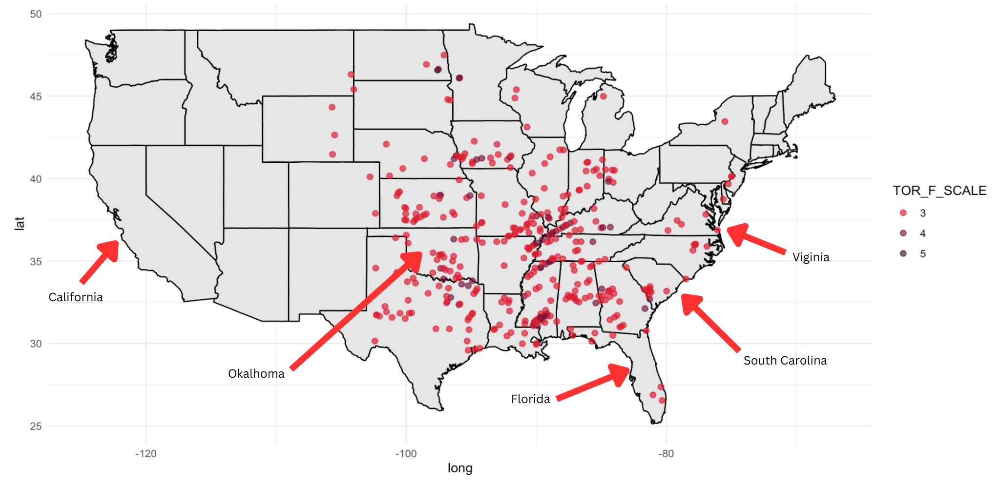

## Scenario

- "You are an analyst for an insurance agency concerned with increasing payouts for property damage with a warming climate."
- "Your boss recently saw Sharknado (2013) while trying to battle insomnia, and has become concerned about the increased likelihood of shark-infested weather as severe weather events become more probable due to climate change."

## Methods

- Great White Shark weighs around 4500 lbs
- Sharks and cars/SUVs weigh similar (4000-4600 lbs)

## Methods Continued

- Tornadoes of magnitude EF3 - EF5 can toss and lift cars
- Identify tornadoes form 2015 - Present
- Analyze tornadoes in specific states/regions

## Results

- 

