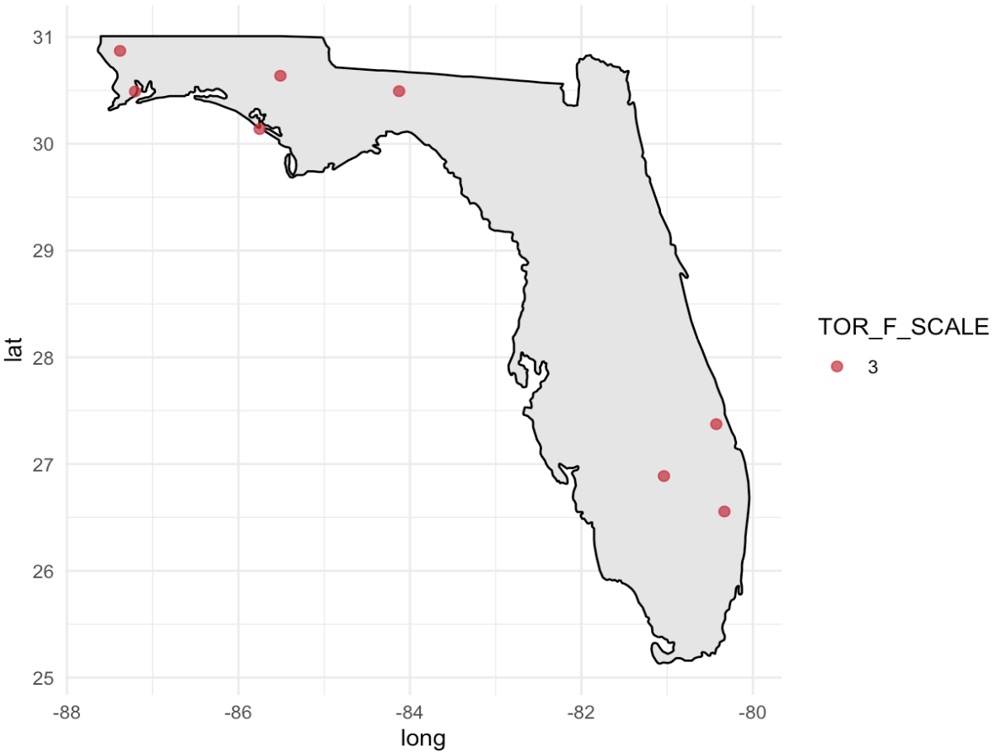
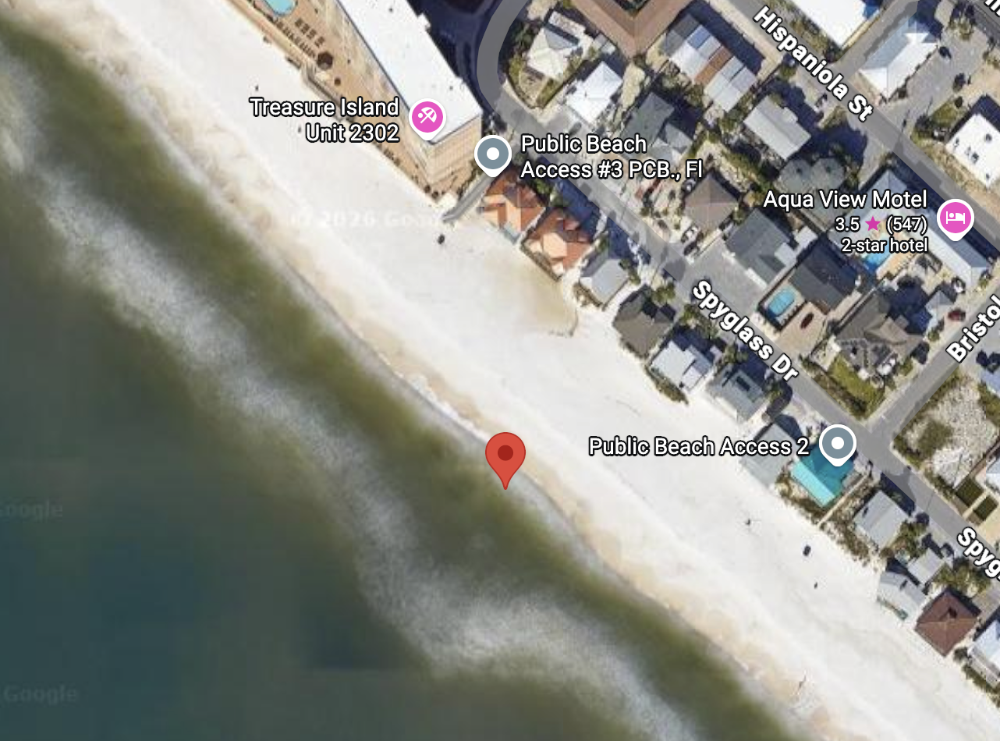
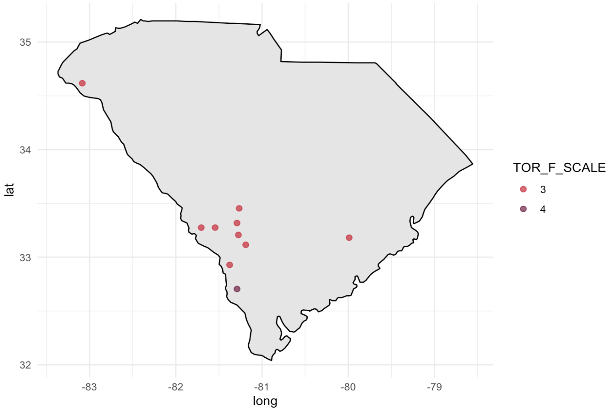
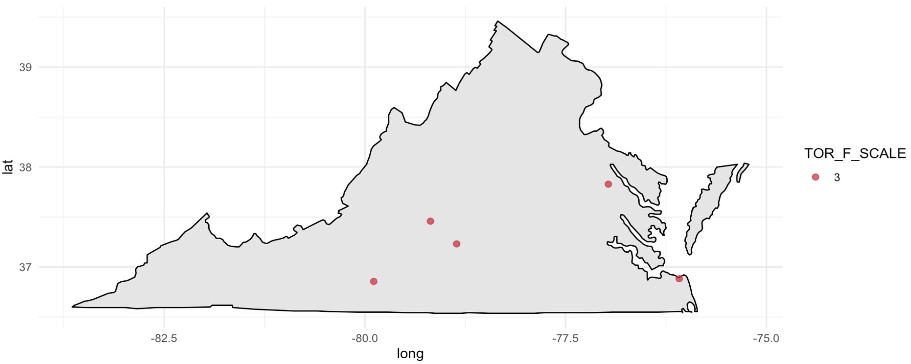
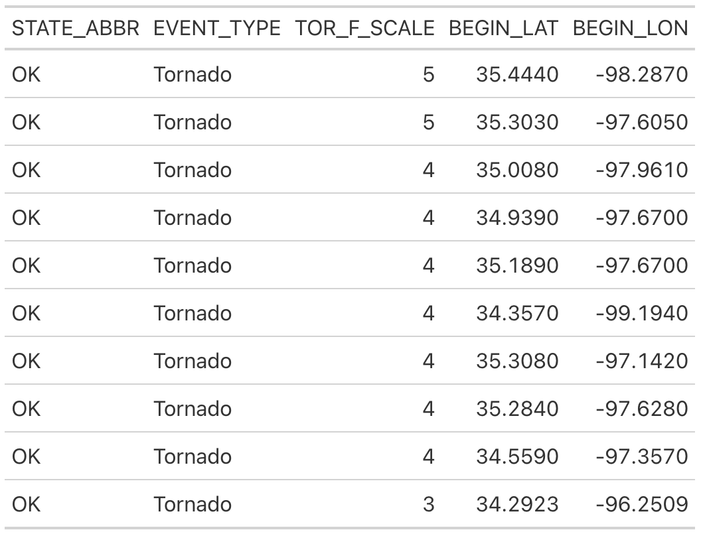
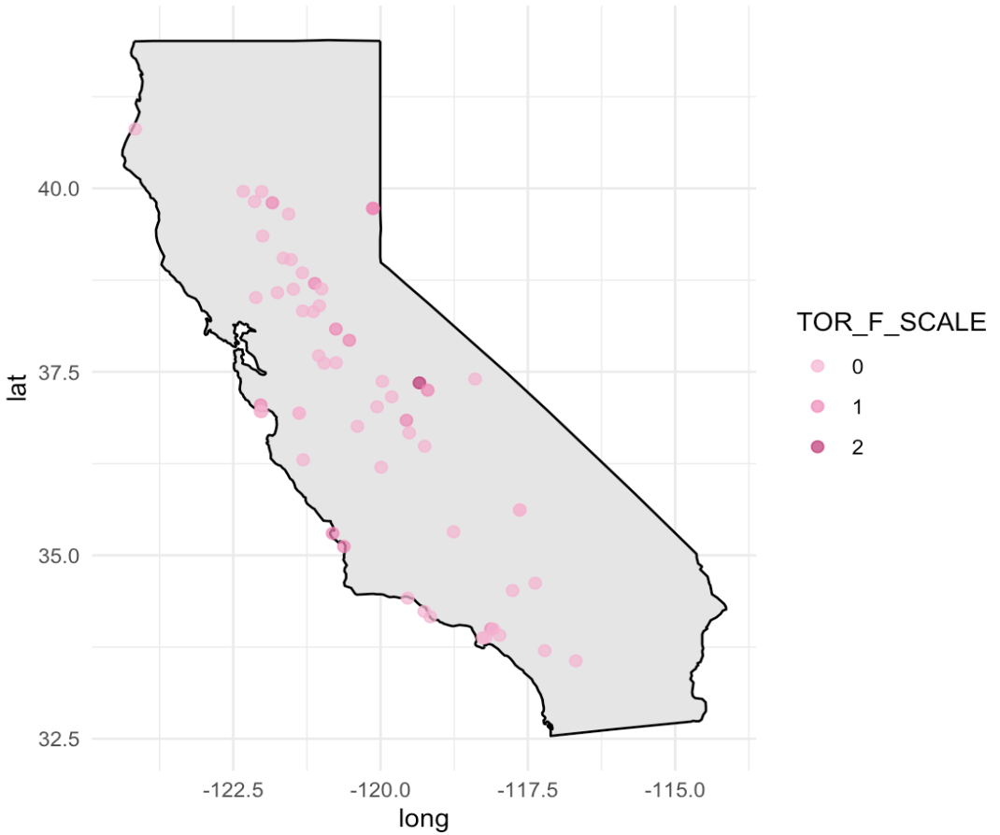
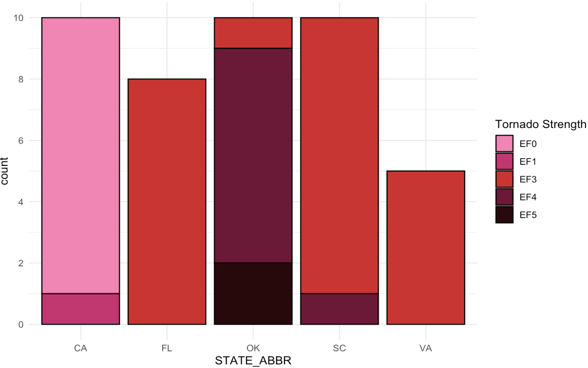
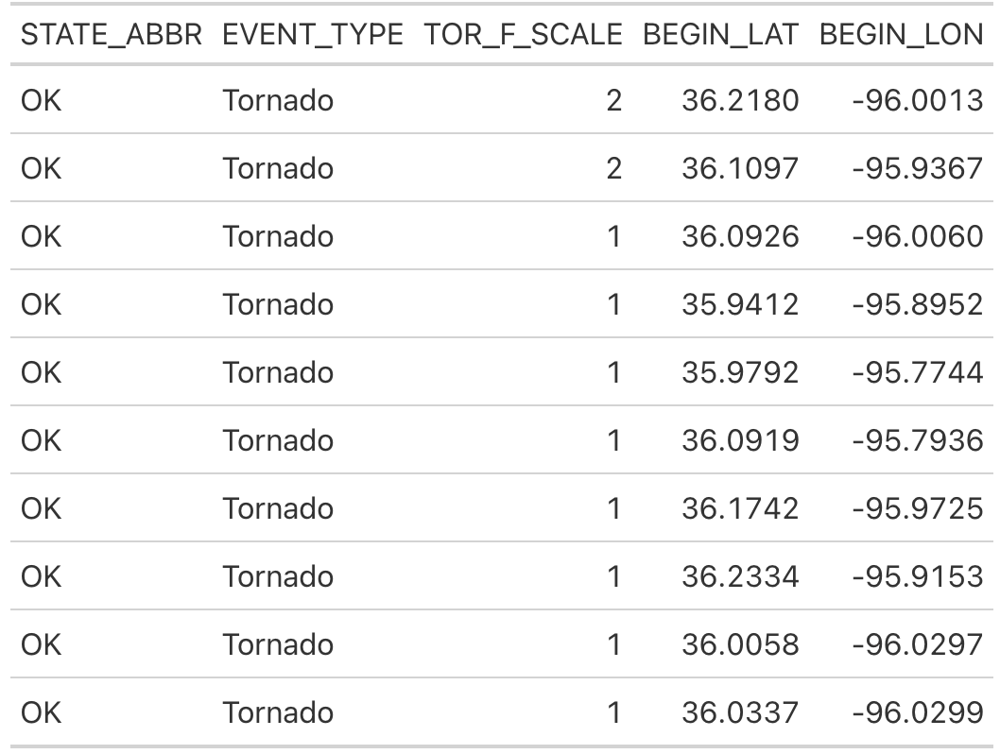

## Scenario

-   "You are an analyst for an insurance agency concerned with increasing payouts for property damage with a warming climate."
-   "Your boss recently saw Sharknado (2013) while trying to battle insomnia, and has become concerned about the increased likelihood of shark-infested weather as severe weather events become more probable due to climate change."

## Data Documentation

-   Tornado data collected from the National Oceanic and Atmospheric Administration Storm Events Database ([NOAA](https://www.ncei.noaa.gov/stormevents/choosedates.jsp?statefips=-999%2CALL))
-   R Software Packages used
    -   tidyverse: data cleaning, data manipulation
    -   gt: better tables
    -   maps: US and State maps

## Methods

-   Great White Shark weighs around 4500 lbs
-   Sharks and cars/SUVs weigh similar (4000-4600 lbs)

## Methods Continued

-   Tornadoes of magnitude EF3 - EF5 can toss and lift cars

::: {style="font-size: .7em; line-height: 1;"}
(EF3 tornadoes not strong enough to start Sharknado but important to see)
:::

-   Identify tornadoes from 2015 - Present
-   Analyze tornadoes in specific states/regions

## States

-   Florida, South Carolina, Virginia chosen for amount of tornadoes EF3 and higher
-   Oklahoma to show rarity of strong tornadoes
-   California for the setting of the film "Sharknado"

::: {style="font-size: 0.5em; line-height: 1;"}
Data collected from [NOAA](https://www.ncei.noaa.gov/stormevents/choosedates.jsp?statefips=-999%2CALL)

Sharknado [Setting](https://www.imdb.com/title/tt2724064/locations/)
:::

## Results: Florida

-   Chosen for amount and location of tornadoes
-   Florida had only five EF3 tornadoes
-   One tornado with potential

::: {style="font-size: .7em; line-height: 1;"}
(EF3 not strong enough to lift and throw a Great White Shark)
:::

::: {layout-ncol="2"}
{width="80%"}

{width="80%"}
:::

## Results: South Carolina

-   Nine EF3 tornadoes, one EF4 tornado
-   All away from coast
-   Unlikely to start Sharknado

## Results: Virginia

-   Five EF3 tornadoes
-   One EF3 tornado close to coast
    -   EF3 not strong enough to lift and throw a Great White Shark

## Results: Oklahoma

-   Ten strongest tornadoes in Oklahoma
    -   One EF3, seven EF4, two EF5
-   Strong tornadoes are rare even in the the tornado capital of US

## Results: California

-   No tornadoes EF3 or higher since 2015
-   Only tornadoes EF2 or lower
-   None strong enough
-   No chance of Sharknado even in the movie setting

## Results: Comparison

-   Distribution of tornadoes by state
-   Only a handful of strong enough tornadoes
    -   OK and CA show ten strongest tornadoes
    

    
## Results: Comparison

-   One tornado in coastal states that is strong enough
    -   That tornado being in South Carolina
    -   Not close enough to coast
-   Unless sharks in Oklahoma there is no chance of Sharknado

## Results: Comparison

-   [Oklahoma Aquarium](https://www.okaquarium.org/176/Shark-Adventure) in Jenks, OK holds Bull Sharks
    -   Jenks is in Tulsa county in OK

## Results: Tulsa County

-   [Bull Sharks](https://www.nwf.org/Home/Educational-Resources/Wildlife-Guide/Fish/Bull-Shark) weigh around 500 lbs
-   Only EF1 and EF2 tornadoes in Tulsa county, OK
-   [EF2](https://www.oreateai.com/blog/the-weighty-truth-how-much-can-a-tornado-lift/22e09faa7969386318853dd21fb2fbe4) tornadoes can move houses off foundations
    -   Not fully strong enough to destroy an aquarium
-   No chance of Sharknado in Oklahoma in last 10 years

## Conclusion

-   From whats shown for each state (FL, SC, VA, OK, CA) Sharknado events are extremely unlikely
-   Oklahoma has many tornadoes strong enough but no Great White Sharks
-   The probability of a Sharknado is very close to, if not, zero
-   Sharknado is not possible but other strong storms and tornadoes pose real threat for insurance payouts

